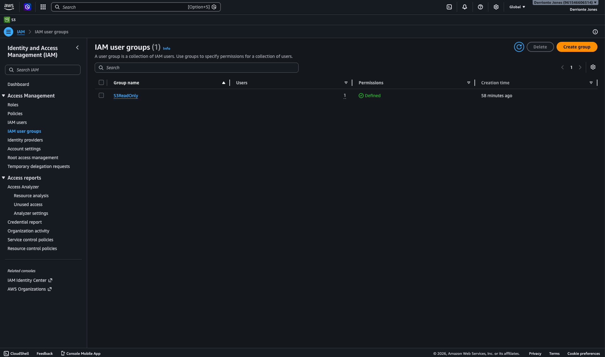
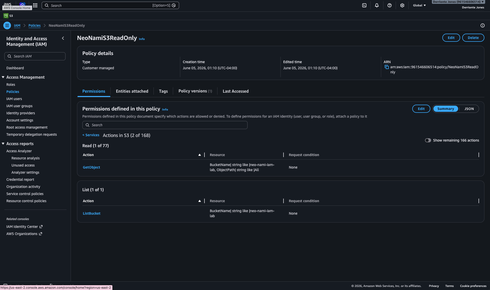
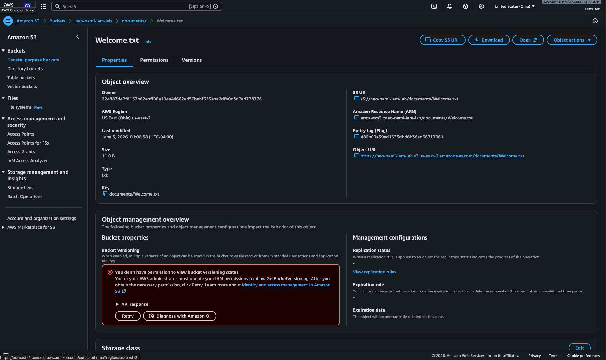
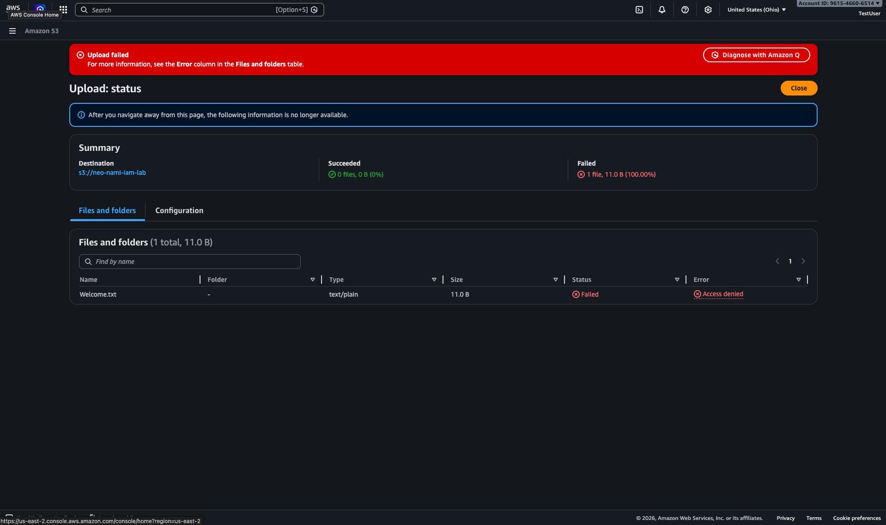

# AWS IAM Least Privilege Lab

## Project Objective

Create an AWS IAM solution using least privilege principles that allows users to read objects from a specific S3 bucket while preventing modification or deletion of resources.

## Services Used

- AWS IAM
- Amazon S3

## Concepts Demonstrated

- IAM Users
- IAM Groups
- Custom IAM Policies
- Least Privilege Access Control
- Resource-Based Permissions

The final policy allowed:

* View bucket contents
* Read objects

The final policy prevented:

* Uploading objects
* Deleting objects
* Modifying bucket settings

This implementation follows the Principle of Least Privilege.

## Screenshots

### IAM Group Created

### Policy Created

### Successful Bucket Access

### Upload Denied

## Lessons Learned

During testing, the TestUser account was initially unable to view S3 buckets because the AWS Management Console requires the `s3:ListAllMyBuckets` permission to display bucket listings.

After adding the required permission, the user could successfully view the designated bucket while remaining restricted from uploading, deleting, or modifying resources.

This project demonstrated the principle of least privilege by granting only the permissions necessary to perform assigned tasks.
